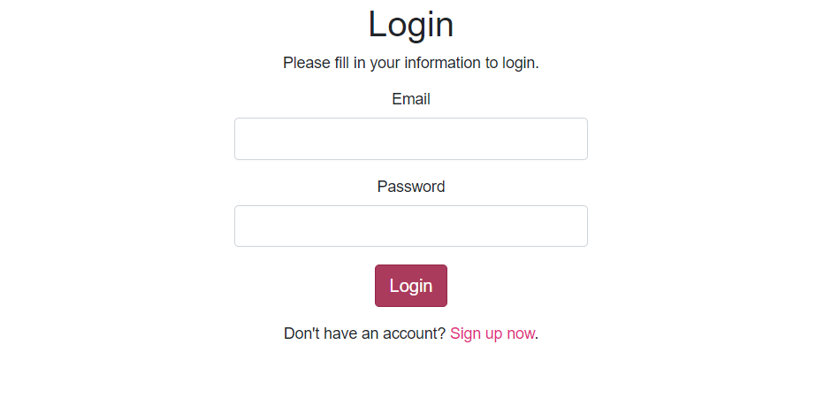
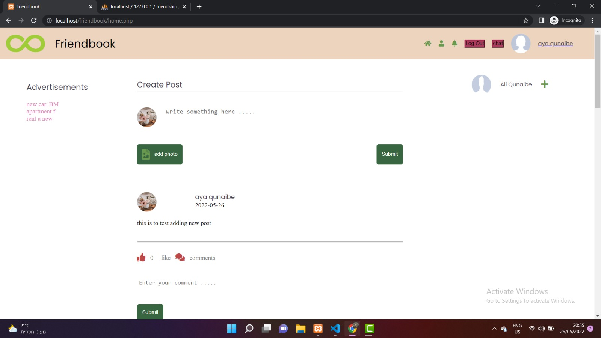
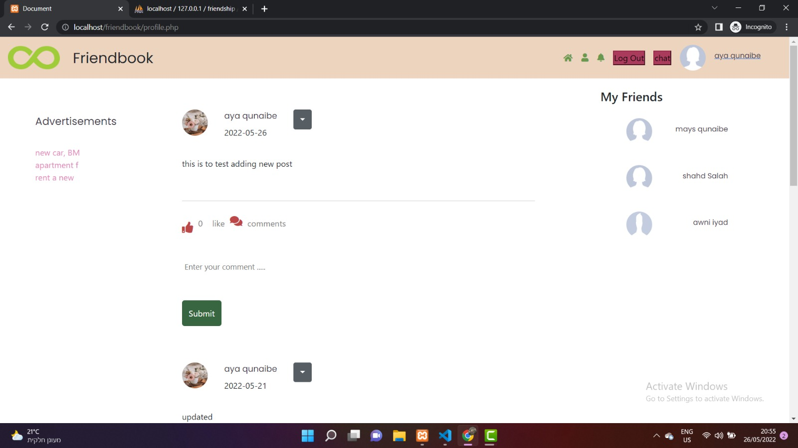
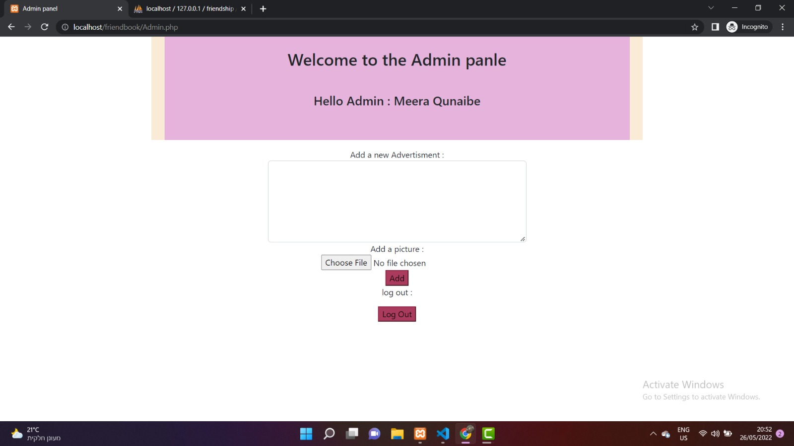

# friendbook
Is a website where we have implemanted all the gained skills through the web tech course .

The website can be reached through the web  , and in order for the user to go through the website pages ,

the user must have an account By signing up through the sign up Page :

after that the user will be directed to the login page to confirm his/her information , then the user will be  able to go throgh the website pages : 

Home page containes friends posts , a navbar to give the user the ability to go through pages , and some sections for adding friends & seeing some advertisments :

when the user clicks on his/her name , the user will be directed to the profile page where he can send massages and see a list of his/her friends.

We also have the admin panle to control users and the advertisments displayed in the admin page

used technologies : php , bootstrab , css , html , ajax , JS , jQuery , sql , apache

Team members  : Meera Qnaiby and Hadeel Qnaiby .
